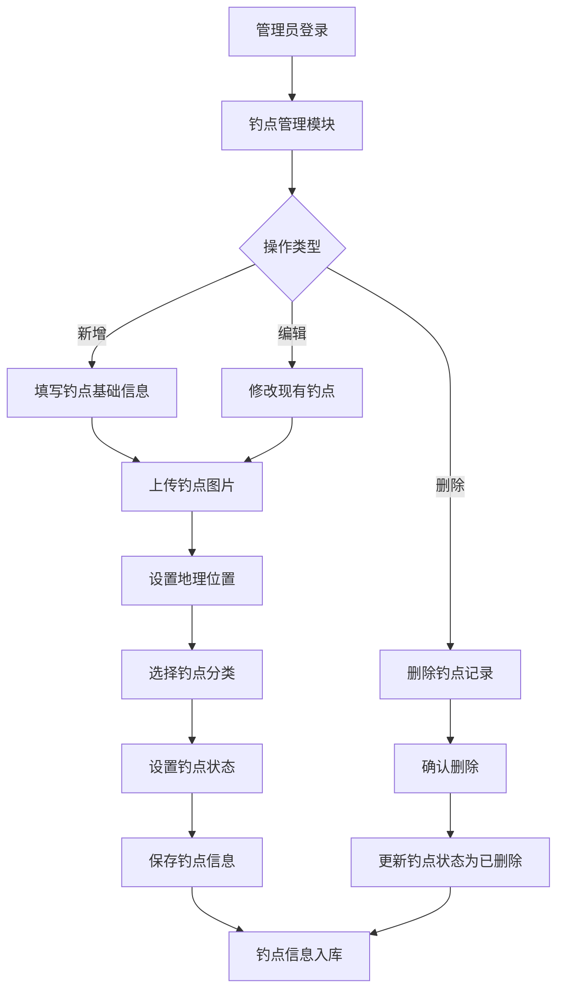
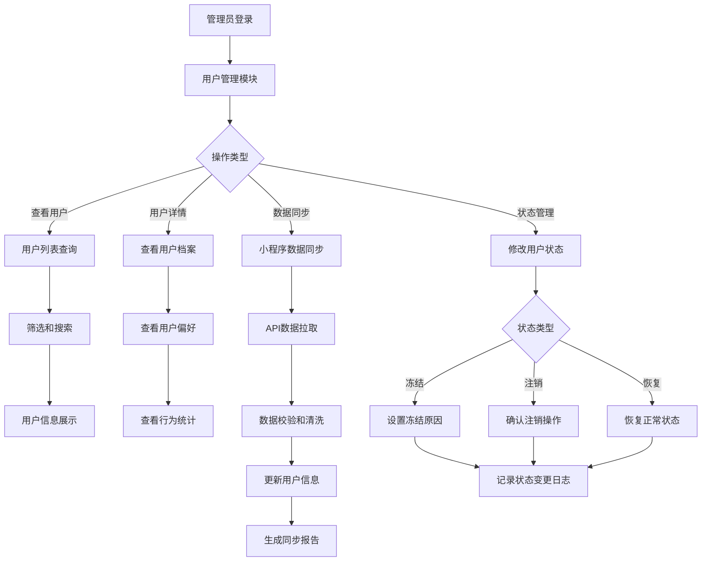

# 钓鱼佬后端管理系统 产品需求文档

## 更新日志

### v1.3 (2024-12-01)
- **功能优化**：简化钓鱼佬用户管理模块，移除复杂的状态管理和评分系统
- **界面简化**：去掉年龄、经验等级、活跃度、用户状态、用户标签等字段
- **数据精简**：保留核心用户信息，专注基础档案和行为统计
- **体验优化**：简化用户管理流程，提升操作效率

### v1.2 (2024-12-01)
- **新增功能**：钓鱼佬用户管理模块，支持小程序用户信息管理
- **用户体系**：建立完整的用户档案管理，包含基础信息、钓鱼偏好、活跃度统计
- **数据同步**：与小程序用户数据实时同步，支持用户状态管理
- **统计分析**：新增用户行为分析和数据统计功能

### v1.1 (2024-12-01)
- **功能优化**：移除审核管理功能模块，简化系统架构
- **鱼种管理优化**：删除栖息环境和最佳钓季字段，聚焦核心信息
- **界面优化**：移除数据看板和引用次数统计，简化管理界面
- **数据结构调整**：更新相关数据表设计和API接口

## 一、需求背景

为钓鱼爱好者提供专业的钓点信息管理平台，通过后端管理系统维护全面的钓点数据库，包括钓点图片、地理位置、环境信息等，帮助钓鱼佬发现和分享优质钓点资源。

## 二、范围边界

### ▶ 包含功能：
- 钓点信息管理（增删改查）
- 钓点图片管理（上传、预览、删除）
- 钓点地理位置管理（地图选点、坐标录入）
- 鱼种类管理（鱼种增删改查、分类管理）
- 钓点状态管理（开放/关闭/维护中）
- **钓鱼佬用户管理（用户档案、状态管理、数据统计）**

### ▶ 不包含：
- 用户端钓点查看功能（由前端APP提供）
- 天气预报集成（由第三方API提供）
- 在线支付功能（暂不涉及付费钓点）

## 三、业务流程

### ▶ 钓点管理流程：

### ▶ 钓鱼佬用户管理流程：

## 四、功能需求详情

### 4.1 钓点基础信息管理

**功能描述：** 支持管理员维护钓点的基础信息，包括名称、描述、特色等

**输入项：**
- 钓点名称（必填，1-50字符）
- 钓点图片（必填，支持多张上传）
- 水深信息（非必填，数值范围0.1-50米）
- 鱼种类（必填，多选，关联鱼种管理）
- 钓点描述（必填，最多500字符）
- 钓点位置（必填，地图选点或坐标录入）
- 钓点攻略（非必填，包括最佳钓位、饵料推荐、钓法技巧等，最多1000字符）

**处理逻辑：**
- 钓点名称重复性校验（同一区域内不允许重名）
- 自动生成钓点唯一编号（格式：FP + 年月日 + 4位序号）
- 保存时记录创建人和创建时间

**输出结果：**
- 生成钓点基础信息记录
- 返回钓点唯一ID

### 4.2 钓点图片管理

**功能描述：** 支持上传、预览、管理钓点相关图片，包括环境照片、鱼获照片等

**输入项：**
- 图片文件（支持JPG/PNG/WEBP，单张不超过5MB）
- 图片分类（环境照片/鱼获照片/设施照片）
- 图片描述（选填，最多100字符）
- 是否设为封面图（单选）

**处理逻辑：**
- 图片格式和大小校验
- 自动压缩和生成缩略图
- 图片水印添加（可选）
- 每个钓点最多支持20张图片
- 封面图唯一性校验

**输出结果：**
- 生成图片访问URL
- 返回图片管理记录

### 4.3 地理位置管理

**功能描述：** 支持通过地图选点或坐标录入的方式设置钓点精确位置

**输入项：**
- 地图选点（集成高德/百度地图API）
- 经纬度坐标（手动输入，格式验证）
- 详细地址（自动解析或手动输入）

**处理逻辑：**
- 坐标格式校验（经度-180~180，纬度-90~90）
- 地址逆向解析（坐标转地址）
- 重复位置检测（半径100米内是否已有钓点）
- 位置合法性校验（不在禁钓区域）

**输出结果：**
- 保存标准化地理位置信息
- 生成地图预览链接

### 4.4 鱼种类管理

**功能描述：** 支持管理员维护系统中的鱼种信息，为钓点管理提供标准化的鱼种数据

**输入项：**
- 鱼种名称（必填，1-30字符）
- 鱼种分类（淡水鱼/海水鱼/洄游鱼）
- 鱼种图片（选填，用于展示识别）
- 鱼种描述（选填，包括外观特征、习性等）
- 适宜钓法（选填，推荐钓法和饵料）
- 鱼种状态（启用/禁用）

**处理逻辑：**
- 鱼种名称重复性校验
- 鱼种分类标准化管理
- 关联钓点数量统计
- 支持鱼种批量导入

**输出结果：**
- 生成鱼种基础信息记录
- 返回鱼种唯一ID
- 更新鱼种统计数据

### 4.5 钓点状态管理

**功能描述：** 管理钓点的运营状态，确保信息准确性

**输入项：**
- 运营状态（正常开放/临时关闭/永久关闭/维护中）
- 状态变更原因（必填）
- 预计恢复时间（临时关闭时必填）
- 状态变更通知（是否推送给关注用户）

**处理逻辑：**
- 状态变更日志记录
- 自动状态恢复（基于预计恢复时间）
- 关联用户通知触发

**输出结果：**
- 更新钓点状态
- 生成状态变更记录

### 4.6 钓鱼佬用户管理

**功能描述：** 管理通过小程序注册的钓鱼佬用户信息，维护用户基础档案和行为数据，支持用户信息查看和数据同步

**输入项：**
- 用户基础信息（昵称、头像、性别、地区）
- 钓鱼偏好设置（喜欢的鱼种、常去钓点类型、钓鱼时间偏好、装备水平）
- 联系方式（手机号、微信号、真实姓名）
- 注册时间（系统自动记录）

**处理逻辑：**
- 与小程序用户数据实时同步（通过API接口）
- 用户唯一性校验（基于微信OpenID）
- 用户行为数据统计（钓鱼天数、总渔获、平均渔获、最爱钓点、最后活跃时间）
- 敏感信息脱敏处理（手机号、身份证号）
- 数据同步日志记录

**输出结果：**
- 生成用户档案记录
- 返回用户唯一ID
- 更新用户行为统计
- 生成数据同步报告

## 五、非功能需求

| 类型 | 要求 |
|---|---|
| 性能 | 图片上传响应时间≤3秒，页面加载时间≤2秒，用户数据同步响应时间≤1秒 |
| 容量 | 支持10万个钓点信息，100万钓鱼佬用户，单钓点图片存储≤100MB |
| 可用性 | 系统可用性≥99.5%，支持7×24小时运行 |
| 兼容性 | 支持Chrome、Firefox、Safari等主流浏览器 |
| 安全性 | 数据传输HTTPS加密，图片防盗链保护，用户敏感信息脱敏处理 |

## 六、数据需求

### ▶ 核心数据表设计：

| 字段名 | 数据类型 | 说明 | 示例值 |
|---|---|---|---|
| fishing_spot_id | VARCHAR(20) | 钓点唯一ID | FP20241201001 |
| spot_name | VARCHAR(50) | 钓点名称 | 西湖断桥野钓点 |
| longitude | DECIMAL(10,7) | 经度坐标 | 120.1234567 |
| latitude | DECIMAL(10,7) | 纬度坐标 | 30.2345678 |
| address | VARCHAR(200) | 详细地址 | 浙江省杭州市西湖区断桥残雪景点附近 |
| water_depth | DECIMAL(4,1) | 水深（米） | 3.5 |
| description | TEXT | 钓点描述 | 环境优美，水质清澈，适合休闲垂钓 |
| fishing_guide | TEXT | 钓点攻略 | 最佳钓位在桥下阴凉处，推荐使用蚯蚓饵料... |
| status | ENUM | 钓点状态 | open/closed/maintenance |
| cover_image_url | VARCHAR(500) | 封面图片URL | https://img.fishing.com/spots/cover_001.jpg |
| rating | DECIMAL(2,1) | 综合评分 | 4.5 |
| created_by | VARCHAR(50) | 创建人 | admin_001 |
| created_at | TIMESTAMP | 创建时间 | 2024-12-01 10:30:00 |
| updated_at | TIMESTAMP | 更新时间 | 2024-12-01 15:20:00 |

### ▶ 关联数据表：

**钓点图片表 (fishing_spot_images)**
- image_id, fishing_spot_id, image_url, image_type, description, is_cover, upload_time

**鱼种信息表 (fish_species)**
- species_id, species_name, category, image_url, description, fishing_method, status, created_at, updated_at

**钓点鱼种关联表 (fishing_spot_species)**
- id, fishing_spot_id, species_id, created_at

**钓点状态变更日志表 (fishing_spot_status_logs)**
- log_id, fishing_spot_id, old_status, new_status, reason, operator, created_at

**钓鱼佬用户信息表 (fishing_users)**
- user_id, openid, nickname, avatar_url, gender, region, phone, wechat_id, real_name, created_at, updated_at, last_active_at

**用户钓鱼偏好表 (user_fishing_preferences)**
- preference_id, user_id, preferred_fish_species, preferred_spot_types, preferred_time, equipment_level, created_at, updated_at

**用户行为统计表 (user_behavior_stats)**
- stat_id, user_id, total_fishing_days, total_catch, average_catch_per_day, favorite_spot, last_active_time, created_at, updated_at

## 七、接口需求

### ▶ 核心API接口：

| 接口名称 | 请求方式 | 接口路径 | 功能描述 |
|---|---|---|---|
| 获取钓点列表 | GET | /api/fishing-spots | 分页查询钓点信息 |
| 创建钓点 | POST | /api/fishing-spots | 新增钓点信息 |
| 更新钓点 | PUT | /api/fishing-spots/{id} | 修改钓点信息 |
| 删除钓点 | DELETE | /api/fishing-spots/{id} | 删除钓点信息 |
| 上传钓点图片 | POST | /api/fishing-spots/{id}/images | 上传钓点图片 |
| 获取钓点详情 | GET | /api/fishing-spots/{id} | 查询单个钓点详细信息 |
| 更新钓点状态 | PATCH | /api/fishing-spots/{id}/status | 修改钓点运营状态 |

| 获取鱼种列表 | GET | /api/fish-species | 分页查询鱼种信息 |
| 创建鱼种 | POST | /api/fish-species | 新增鱼种信息 |
| 更新鱼种 | PUT | /api/fish-species/{id} | 修改鱼种信息 |
| 删除鱼种 | DELETE | /api/fish-species/{id} | 删除鱼种信息 |
| 批量导入鱼种 | POST | /api/fish-species/batch | 批量导入鱼种数据 |

| 获取用户列表 | GET | /api/fishing-users | 分页查询钓鱼佬用户信息 |
| 获取用户详情 | GET | /api/fishing-users/{id} | 查询单个用户详细信息 |
| 更新用户信息 | PUT | /api/fishing-users/{id} | 修改用户基础信息 |
| 获取用户统计 | GET | /api/fishing-users/{id}/stats | 获取用户行为统计数据 |
| 同步小程序用户 | POST | /api/fishing-users/sync | 从小程序同步用户数据 |
| 用户数据分析 | GET | /api/fishing-users/analytics | 获取用户数据分析报告 |

## 八、验收标准

### ▶ 功能验收：
1. **钓点管理**：能够完成钓点的增删改查操作，包含钓点名称、图片、水深、鱼种、描述、攻略等字段，数据保存准确
2. **图片管理**：支持多图片上传，自动生成缩略图，封面图设置正常
3. **位置管理**：地图选点功能正常，坐标数据准确，地址解析正确
4. **鱼种管理**：鱼种增删改查功能完整，支持分类管理和批量导入，关联钓点功能正常
5. **状态管理**：状态变更及时生效，日志记录完整
6. **用户管理**：用户信息同步准确，基础信息展示正常，行为统计数据完整，数据查看功能正常

### ▶ 性能验收：
1. 图片上传时间≤3秒（5MB以内图片）
2. 钓点列表加载时间≤2秒（100条记录）
3. 地图加载和选点响应时间≤1秒
4. 支持并发50个管理员同时操作
5. 用户数据同步响应时间≤1秒（单次同步1000条用户数据）
6. 用户列表查询时间≤2秒（1000条用户记录）

### ▶ 数据验收：
1. 钓点信息完整性校验通过率100%
2. 图片存储和访问成功率≥99.9%
3. 地理位置数据准确性≥99.5%
4. 数据备份和恢复功能正常
5. 用户数据同步准确率≥99.9%
6. 用户敏感信息脱敏处理覆盖率100%

## 九、风险评估

### ▶ 技术风险：
- **地图API限制**：第三方地图服务可能存在调用限制
- **图片存储成本**：大量图片上传可能导致存储成本上升
- **并发处理**：高并发图片上传可能影响系统性能

### ▶ 业务风险：
- **数据质量**：钓点信息准确性依赖管理员维护质量
- **位置隐私**：部分钓点位置可能涉及隐私或法律问题

### ▶ 风险应对：
1. 建立多个地图API备选方案
2. 实施图片压缩和CDN加速策略
3. 设计分布式图片处理架构
4. 建立钓点信息质量评估体系
5. 实施用户数据加密和脱敏保护机制
6. 建立数据同步监控和异常处理机制

### ▶ 引用接口地址
1. 地图接口：https://www.tianditu.gov.cn/
2. 天气接口：http://www.weatherdt.com/
3. 水文接口
---

**文档版本：** v1.3  
**创建日期：** 2024-12-01  
**最后更新：** 2024-12-01  
**创建人：** 产品经理  
**更新说明：** 优化钓鱼佬用户管理模块，简化功能和界面，提升用户体验  
**审核状态：** 已更新